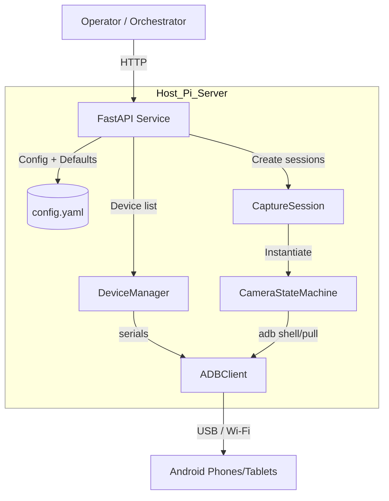
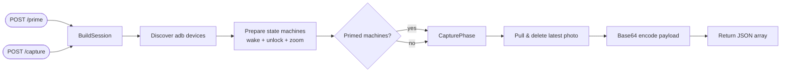

# AMCCS — Android Multi-cam Camera System

AMCCS orchestrates synchronized photo capture from every Android device connected via adb. It exposes a FastAPI surface for orchestration, wraps adb with async helpers, and provides a repeatable test suite suitable for open-source collaboration.

## Features

- Automatic adb device discovery with pluggable position strategies.
- Two-phase prime/capture state machine to keep devices ready on demand.
- Configurable config search paths, strict YAML validation, and safe defaults.
- Optional Bearer-token authentication for HTTP endpoints.
- Structured JSON logging for every lifecycle, prime, capture, and health event.
- Hardened adb subprocess execution with configurable timeouts.

## Architecture at a Glance



FastAPI orchestrates configuration loading and session management. Device discovery flows through `DeviceManager`, state machines wrap per-device workflows, and every action ultimately goes through `ADBClient` toward the connected Android hardware.

## Capture Workflow



`/prime` performs the preparation step and caches machines for later reuse. `/capture` either leverages cached machines or runs the full prime+capture sequence before packaging the response.

## Quick Start

```bash
git clone https://github.com/eapCJ/amccs.git
cd amccs
python -m venv .venv
source .venv/bin/activate
pip install -e .[test]
cp config.example.yaml config.yaml  # adjust for your devices
uvicorn amccs.service:create_app --factory --reload
```

AMCCS loads configuration once at startup. Place `config.yaml` in the project root, set `CAMERA_CONFIG_PATH`, or provide additional directories via `CAMERA_CONFIG_SEARCH_PATHS` (colon-separated).

## Configuration

`config.example.yaml` documents every required field:

```yaml
settings:
  request_timeout_seconds: 10          # overall FastAPI capture timeout
  adb_command_timeout_seconds: 5       # per-adb command timeout
  camera_defaults:
    package: com.android.camera
    activity: .CameraActivity
    photo_location: /sdcard/DCIM/Camera
    zoom_point: {x: 540, y: 960}
    delays:
      camera_open: 1.5
      zoom: 0.5
      photo_capture: 0.8
      photo_save: 1.0
```

Environment variables:

| Variable | Description |
| --- | --- |
| `CAMERA_CONFIG_PATH` | Absolute/relative path to the YAML file. Overrides everything else. |
| `CAMERA_CONFIG_SEARCH_PATHS` | Additional search paths (use `:` as separator) checked before the defaults. |
| `CAMERA_API_TOKEN` | Enables Bearer-token auth. Clients must send `Authorization: Bearer <token>` on mutating endpoints. |
| `AMCCS_LOG_LEVEL` | Set to `DEBUG`, `INFO`, etc. Defaults to `INFO`. |

## API

- `GET /` – service metadata, config path, timeout, and whether auth is enabled.
- `GET /health` – live adb echo check for every detected device.
- `POST /prime` – wakes/unlocks/launches/zooms each connected device (requires auth when enabled).
- `POST /capture` – captures photos from primed devices or primes+captures in one step (requires auth when enabled). Returns Base64-encoded payloads for each device.

## Security & Authentication

Set `CAMERA_API_TOKEN` (or pass `api_token` into `create_app`) to require `Authorization: Bearer <token>` on `/prime` and `/capture`. Always deploy behind TLS and rotate tokens via your secret manager. See [SECURITY.md](SECURITY.md) for disclosure instructions.

## Deployment

- **ASGI runtime**: `uvicorn amccs.service:create_app --factory --host 0.0.0.0 --port 8000`
- **Gunicorn example**: `gunicorn -k uvicorn.workers.UvicornWorker "amccs.service:create_app"`
- **Systemd tip**: point `WorkingDirectory` at your config path and export `CAMERA_CONFIG_PATH=/etc/amccs/config.yaml`.
- Ensure `adb` is on `PATH`, USB debugging is enabled, and the service account has access to all devices.

## Development

```bash
pip install -e .[test,dev]
ruff check
mypy src tests
pytest
```

See [CONTRIBUTING.md](CONTRIBUTING.md) for code-style expectations, issue guidelines, and contact info. GitHub Actions runs lint, type checks, and tests on every push/pull request via `.github/workflows/ci.yml`.

### Integration Tests

An optional adb-backed smoke test lives in `tests/test_integration_adb.py`. It is skipped by default and only runs when you knowingly opt in:

```bash
export AMCCS_INTEGRATION_ADB=1
# Optional knobs:
#   AMCCS_INTEGRATION_MIN_DEVICES=2
#   AMCCS_INTEGRATION_TARGET_SERIAL=ZX1G22B
#   AMCCS_INTEGRATION_SHELL_COMMAND="echo hello"
#   AMCCS_INTEGRATION_EXPECTED_OUTPUT="hello"
pytest -m integration
```

Use this when you have physical devices attached and want a quick sanity check that adb commands succeed end-to-end.

## Raspberry Pi Deployment

The service runs comfortably on a Raspberry Pi 4 (2 GB). Below is a reference setup that installs AMCCS under `/opt/amccs`, exposes the API on port 8080, and keeps the repository up-to-date via a timer.

> Need more detail? See the full [Deployment Guide](docs/DEPLOYMENT.md).

### System Requirements

- Raspberry Pi OS Bookworm (64-bit recommended)
- Python 3.11+
- `adb` and access to USB-debugging-enabled devices

Install prerequisites:

```bash
sudo apt update
sudo apt install -y python3.11 python3.11-venv git adb
```

### Checkout & Install

Fastest path (run as root):

```bash
curl -fsSL https://raw.githubusercontent.com/eapCJ/adb_multicam/master/deploy/install.sh | sudo bash
```

The script installs prerequisites, creates `/opt/amccs`, sets up the virtualenv, copies config/env templates, and installs the systemd service plus auto-update timer. Afterwards, edit `/etc/amccs.env` and `/opt/amccs/config.yaml`, then `sudo systemctl restart amccs`.

Manual alternative:

```bash
sudo useradd -r -s /usr/sbin/nologin amccs || true
sudo mkdir -p /opt/amccs && sudo chown amccs:amccs /opt/amccs
sudo -u amccs bash -lc '
  cd /opt/amccs
  git clone https://github.com/eapCJ/adb_multicam.git .
  python3.11 -m venv .venv
  source .venv/bin/activate
  pip install -U pip
  pip install -e .[test]
  cp config.example.yaml config.yaml  # edit to match your devices
'
```

### Systemd Service

Create `/etc/systemd/system/amccs.service`:

```ini
[Unit]
Description=AMCCS Android Multi-cam Service
After=network-online.target

[Service]
Type=simple
User=amccs
WorkingDirectory=/opt/amccs
EnvironmentFile=/etc/amccs.env
ExecStart=/opt/amccs/.venv/bin/uvicorn amccs.service:create_app --factory --host 0.0.0.0 --port 8080
Restart=on-failure

[Install]
WantedBy=multi-user.target
```

Enable and start:

```bash
sudo systemctl daemon-reload
sudo systemctl enable --now amccs.service
```

### Auto-Update Timer

To pull new commits hourly and reinstall the package, add:

`/etc/systemd/system/amccs-update.service`

```ini
[Unit]
Description=Refresh AMCCS repository

[Service]
Type=oneshot
User=amccs
WorkingDirectory=/opt/amccs
ExecStart=/bin/bash -lc '. .venv/bin/activate && git pull --ff-only && pip install -e .'
```

`/etc/systemd/system/amccs-update.timer`

```ini
[Unit]
Description=Run AMCCS auto-update hourly

[Timer]
OnBootSec=5min
OnUnitActiveSec=1h

[Install]
WantedBy=timers.target
```

Enable the timer:

```bash
sudo systemctl enable --now amccs-update.timer
```

Monitor logs with `journalctl -u amccs -f` and use `/health` to verify connected devices after boot.
